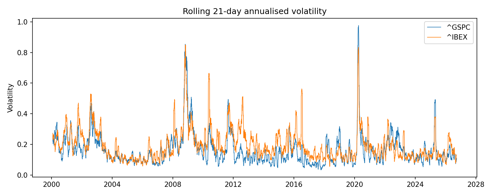
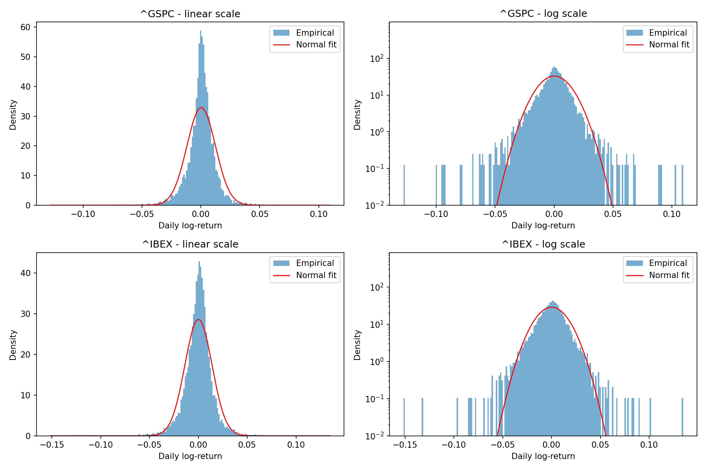
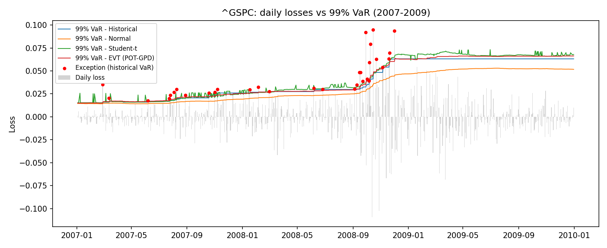
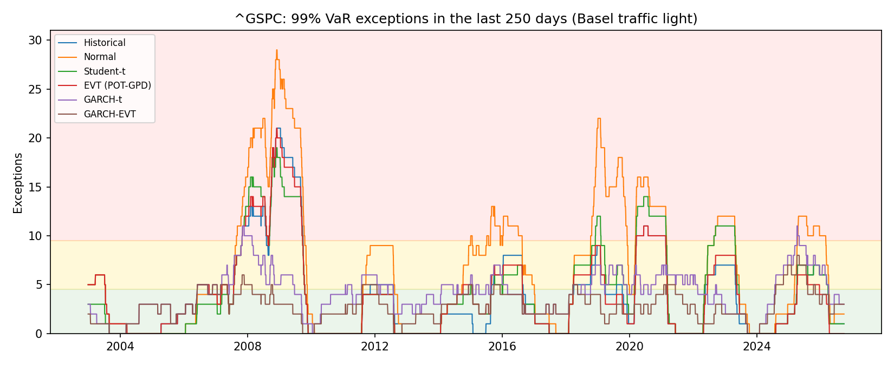

# Empirical Backtesting of VaR and Expected Shortfall

One-day Value-at-Risk (VaR) and Expected Shortfall (ES) models for the
**S&P 500** and the **IBEX 35** (2000–2026), evaluated with formal
statistical backtests, with a focus on crisis periods (2008, 2020, 2022).

This project is the empirical counterpart of my BSc Mathematics thesis,
*Risk Measures*, a functional-analytic study of convex and coherent risk
measures. The thesis explains **why** VaR is not a coherent risk measure
and Expected Shortfall is; this project tests **how** they behave on real data.

> Work in progress — see [Roadmap](#roadmap).

## Data

- Daily adjusted closing prices from Yahoo Finance: `^GSPC` (S&P 500) and `^IBEX` (IBEX 35), Jan 2000 – Sep 2026.
- Both are **price indices** (dividends excluded).
- Each index is treated separately, since they follow different exchange holiday calendars.

## Conventions

- Log-returns: $r_t = \ln(P_t / P_{t-1})$.
- Losses: $L_t = -r_t$, so VaR and ES are reported as **positive numbers**.
- A VaR **exception** on day $t$ occurs when $L_t > \mathrm{VaR}_t$.
- Forecasts for day $t$ only use information available up to day $t-1$ (no look-ahead bias).

## Stylized facts

|                        |        S&P 500      |       IBEX 35       |
|------------------------|---------------------|---------------------|
| Number of observations |        6722         |       6800          |
| Annualized mean        |        6.3%         |       2.0%          |
| Annualized volatility  |       19.2%         |      22.1%          |
| Skewness               |       −0.35         |      −0.32          |
| Excess kurtosis        |       10.7          |       8.2           |
| Worst day              | −12.8% (2020-03-16) | −15.2% (2020-03-12) |
| Best day               | +11.0% (2008-10-13) | +13.5% (2010-05-10) |
| Jarque–Bera p-value    |      < 0.001        |     < 0.001         |

*Returns are log-returns.*

**Key takeaways**

- **Fat tails.** The worst S&P 500 day was a **10.5** $\sigma$ move. Under normality, such a day would be expected roughly once every $10^{23}$ years, yet it happened in this 26-year sample. A Gaussian VaR therefore underestimates tail risk.
- **Negative skewness.** Large losses are more frequent than large gains of the same size.
- **Volatility clustering.** The best days of both indices occurred in the middle of crises (Lehman 2008, the euro crisis 2010). Extreme moves come in clusters, which motivates GARCH-type models.
- **Volatility ≠ tail risk.** The IBEX is more volatile, but the S&P 500 has heavier tails.

**Volatility clustering.** Rolling one-month volatility ranges from below 10% in calm years (2017) to around 80% in October 2008 and close to 100% in March 2020.



**Fat tails.** On a log scale, the Normal density (red) vanishes beyond ±5%, while observed daily returns reach −10% to −15%.



## Rolling VaR forecasts

One-day 99% VaR and ES forecasts with a 500-day rolling window. The forecast
for day *t* only uses losses up to *t − 1*. A correct 99% VaR should be
breached on **1%** of days.

| Exception rate | S&P 500 | IBEX 35 |
|---|---|---|
| Historical simulation | 1.53% | 1.33% |
| Normal | 2.48% | 1.95% |
| Student-t | 1.58% | 1.49% |
| EVT (POT-GPD, 90% threshold) | 1.53% | 1.19% |

*S&P 500: 6,222 forecasts (2002–2026). IBEX 35: 6,300 forecasts (2002–2026).*

**Key takeaways**

- **The Gaussian VaR breaches 2.5× more often than it should** on the S&P 500, a direct consequence of fat tails.
- **Fixing the tails is not enough.** The Student-t improves on the Normal but not on historical simulation, and no model gets below 1.3%. The main problem is *dynamics*: a 500-day equally weighted window reacts too slowly to volatility changes.
- **A symmetric Student-t can underperform historical simulation** (IBEX): returns are negatively skewed, so the loss tail is heavier than the gain tail.
- **EVT fixes the asymmetry problem.** By modeling only the loss tail, EVT is the best model on the IBEX (1.19%), well ahead of the symmetric Student-t (1.49%).
- **At 99% with a 500-day window, EVT ≈ historical simulation** (identical on the S&P 500): the 99% quantile still lies inside the data. EVT's advantage appears when extrapolating further into the tail (99.9% VaR, Expected Shortfall).



*All three models underestimated risk going into 2008, breached in clusters during the crisis, and then stayed overly conservative for two years while crisis days remained in the window.*

## Formal backtests

### Methodology

Let $I_t = \mathbf{1}_{\{L_t > \mathrm{VaR}_t\}}$ be the **exception (hit) sequence**.
If the VaR model at confidence level $\alpha$ is correct, $I_t$ must satisfy two properties
(Christoffersen, 1998):

1. **Unconditional coverage:** $P(I_t = 1) = p$, with $p = 1 - \alpha$.
2. **Independence:** $I_t$ is independent of $I_{t-1}, I_{t-2}, \dots$, so exceptions do not cluster in time.

Together, they mean that $I_t \overset{iid}{\sim} \mathrm{Bernoulli}(p)$.

#### Kupiec (1995): proportion-of-failures test

With $x$ exceptions in $n$ days and observed rate $\hat\pi = x/n$, the test compares

$$
H_0: P(I_t = 1) = p \qquad \text{vs.} \qquad H_1: P(I_t = 1) \neq p
$$

through the likelihood ratio of two binomial models:

$$
LR_{uc} = -2 \ln \frac{(1-p)^{n-x} p^{x}}{(1-\hat\pi)^{n-x} \hat\pi^{x}} \overset{H_0}{\sim} \chi^2_1
$$

The test is **two-sided**: it rejects models with too many exceptions (risk underestimated)
and with too few (overly conservative, which ties up unnecessary capital).
Its limitation is that it only counts exceptions and ignores *when* they occur.

#### Christoffersen (1998): independence and conditional coverage

The hit sequence is modelled as a first-order Markov chain. Let $n_{ij}$ be the number of days
with $I_{t-1} = i$ and $I_t = j$, and define

$$
\pi_{01} = \frac{n_{01}}{n_{00} + n_{01}}, \qquad
\pi_{11} = \frac{n_{11}}{n_{10} + n_{11}}, \qquad
\pi = \frac{n_{01} + n_{11}}{n_{00} + n_{01} + n_{10} + n_{11}}
$$

where $\pi_{01}$ is the probability of an exception after a normal day and $\pi_{11}$ the
probability of an exception right after another exception. Under independence,
$\pi_{01} = \pi_{11} = \pi$:

$$
LR_{ind} = -2 \ln \frac{(1-\pi)^{n_{00}+n_{10}} \pi^{n_{01}+n_{11}}}
{(1-\pi_{01})^{n_{00}} \pi_{01}^{n_{01}} (1-\pi_{11})^{n_{10}} \pi_{11}^{n_{11}}}
\overset{H_0}{\sim} \chi^2_1
$$

The **conditional coverage** test checks both properties at once:

$$
LR_{cc} = LR_{uc} + LR_{ind} \overset{H_0}{\sim} \chi^2_2
$$

A model can pass Kupiec and still fail this test, if the right number of exceptions all happen
during the same crisis.

#### Basel traffic light

Banking supervisors count the 99% VaR exceptions over the last 250 trading days
(Basel Committee on Banking Supervision, 1996):

| Zone | Exceptions in 250 days | Capital multiplier |
|---|---|---|
| Green | 0–4 | 3 |
| Yellow | 5–9 | 3.40 – 3.85 |
| Red | 10 or more | 4 (model under review) |

Market-risk capital is roughly *multiplier × average VaR*, so every move into the yellow or
red zone has a direct capital cost for the bank.

### Results

| | S&P 500 | | | IBEX 35 | | |
|---|---|---|---|---|---|---|
| **Model** | **Kupiec p** | **Indep. p** | **Time in red** | **Kupiec p** | **Indep. p** | **Time in red** |
| Historical | <0.001 | <0.001 | 11.6% | 0.011 | <0.001 | 8.0% |
| Normal | <0.001 | <0.001 | 29.1% | <0.001 | <0.001 | 14.5% |
| Student-t | <0.001 | <0.001 | 15.3% | <0.001 | <0.001 | 8.0% |
| EVT (POT-GPD) | <0.001 | <0.001 | 11.8% | **0.14** | <0.001 | 5.5% |

*Kupiec: correct number of exceptions. Independence: Christoffersen (1998).
Time in red: share of days with 10+ exceptions in the last 250 days (Basel).*

**Key takeaways**

- **Only one model out of eight passes the Kupiec test** (EVT on the IBEX), and it still fails the independence test.
- **All models fail independence.** After a VaR breach, the probability of another breach jumps from ~1.3% to ~9.5%, regardless of the model. Better tails fix the *count* of exceptions, not their *clustering*.
- **The regulatory cost is large.** The Gaussian VaR would have been in the Basel red zone 29% of the time on the S&P 500, with up to 29 exceptions in a single year (vs. a maximum of 4 for the green zone).
- **Conclusion:** unconditional models with an equally weighted 500-day window cannot react to volatility regimes. Conditional volatility (GARCH) is needed.



## Project structure

```
src/varbacktest/   library code (data, models, backtests)
tests/             unit tests (pytest)
scripts/           analysis scripts that produce tables and figures
figures/           generated charts
data/              local price cache (not tracked by git)
```

## How to run

```bash
python -m venv .venv
source .venv/bin/activate
pip install -r requirements.txt
pip install -e .

python scripts/01_explore_data.py   # stylized facts table and figures
pytest                              # unit tests
```

## Roadmap

- [x] Data pipeline: download, cleaning, local cache
- [x] Exploratory analysis and stylized facts
- [x] VaR/ES models: historical simulation, Normal, Student-t (rolling window), EVT
- [x] VaR backtests: Kupiec, Christoffersen, Basel traffic light
- [ ] GARCH(1,1) with Student-t innovations
- [ ] ES backtest: Acerbi–Szekely
- [ ] Crisis analysis (2008, 2020, 2022) and final results